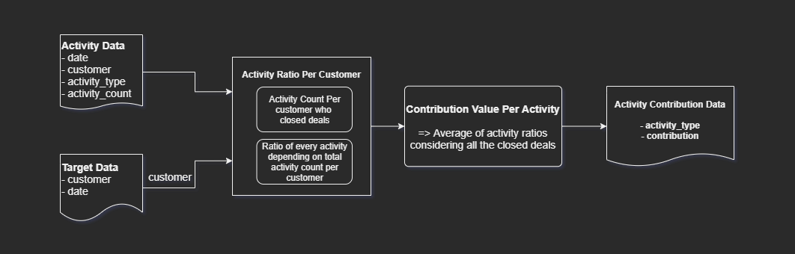

# Activity Contribution

## Methodology



The preceding diagram provides a brief overview of the algorithm used to measure activity contribution value. The whole process can be divided into two major steps:

- **Activity Ratio Per Customer:** After analyzing and comparing the *activity.csv* and *target.csv* data, it can be noticed there was no date of a particular customer in activity data after the deals were closed. I checked this to find out if there are any discrepancies with the reality. So, the date column in target data was not necessary anymore. The customer column was taken from *target.csv* for further computations. For future reference, let's call this column list *target_customers*.  A dictionary named *activity_dict* was built to count the activities per customer who closed the deals. The dictionary format is the following:

  ```python
  # dictionary format of 'activity_dict'
  {
      customer_id:
      {
          activity_type: count # count initialized with 0
      }
  }
  ```

  Then, all the rows of *activity.csv* data were iterated and in each iteration, I checked if the customer in the row exists in *target_customers*. If it does, I checked the *activity_type* and *activity_count* and incremented corresponding *activity_type* count of the *activity_dict*. *activity_count* was ***1*** all over the *activity.csv* dataset. While doing this, I analyzed the data further and noticed that there are ***221 customers*** who closed the deals without any activity contribution. It is clear that there is some missing data or some deals got canceled. 

- **Contribution Value Per Activity:** *activity_dict* built in the preceding step is the main focus of this step. For each activity, I took an average of the activity ratios for all customers with whom deals were closed. The result was then stored in *activity_contribution.csv* 

## Possible Improvements

There are some of the following improvements possible:

1. As I mentioned earlier there are 221 customers with no activity contribution. This is probably some missing data or deal cancellation. But I think if these are deal cancellations these should not be included in the dataset. But if these are not deal cancellations, the missing data should be restored to get better performance.
2. The time complexity can be improved if needed for production. The operations can be done much faster than I did in my algorithm. But, since it was a data analysis problem, improving time complexity after a certain extent can be ignored.